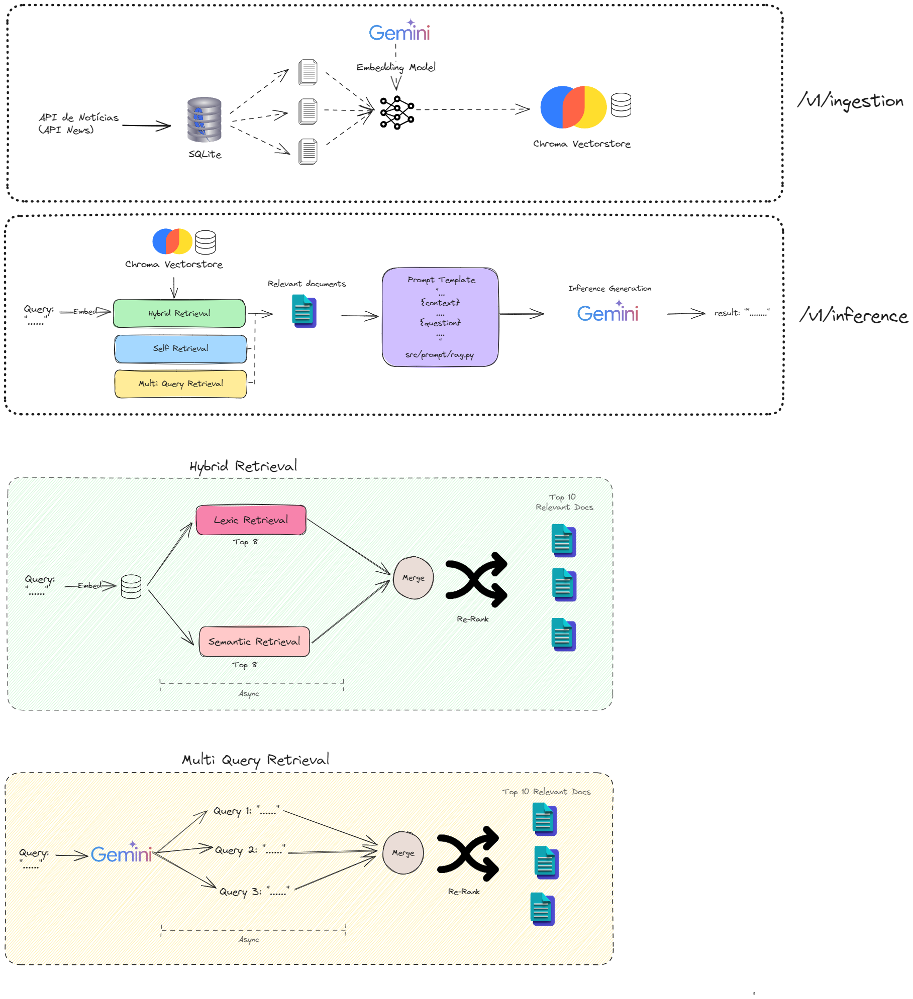

# Estrutura do Projeto: LLM-RAG-FINANCE-NEWS

Este projeto parece ser um sistema baseado em RAG (Retrieval-Augmented Generation) para notícias financeiras. A estrutura está organizada da seguinte forma:

```plaintext
LLM-RAG-FINANCE-NEWS/
│── notebooks/           # Notebooks Jupyter para experimentos e análises
│── src/                 # Código-fonte principal do projeto
│   │── config/          # Configurações globais do projeto
│   │── database/        # Módulos de interação com bancos de dados
│   │── engines/         # Motores de busca ou processamento
│   │── pipelines/       # Fluxos de processamento de dados e inferência
│   │── prompt/          # Templates e lógica para prompts do modelo
│   │── routes/          # Definição de rotas da API (FastAPI ou similar)
│   │   │── inference_router.py  # Rota para chamadas de inferência do modelo
│   │   │── ingestion_router.py  # Rota para ingestão de dados no sistema
│   │   │── retrieval_router.py  # Rota para recuperação de informações
│   │── utils/          # Funções utilitárias e auxiliares
│   │── main.py       # Ponto de entrada principal da aplicação
│── .env                  # Variáveis de ambiente
│── .gitignore            # Arquivo para ignorar arquivos no Git
│── mindmap.excalidraw    # Mapa mental do projeto
│── README.md             # Documentação principal do projeto
│── requirements.txt      # Lista de dependências do projeto
```

## Configuração do Ambiente Virtual no Python  

Ao trabalhar em projetos Python, é recomendável utilizar um ambiente virtual para isolar as dependências do projeto e evitar conflitos entre diferentes pacotes.  

## Criando o Ambiente Virtual  
Para criar um ambiente virtual chamado `env`, utilize o seguinte comando: 

```sh
pip install virtualenv
```

```sh
python -m venv env
```
#### Windows (CMD ou PowerShell):

```sh
.\env\Scripts\Activate
```


#### MacOS/Linux:

```sh
source env/bin/activate
```

## Instalando Dependências
Após ativar o ambiente virtual, instale as dependências do projeto utilizando o arquivo requirements.txt:
```sh
pip install -r requirements.txt
```

## Configuração do .env

```yaml
HUGGINGFACE_TOKEN= <YOUR HUGGING FACE TOKEN>
API_NEWS_KEY= <YOUR API NEWS TOKEN>
GOOGLE_API_KEY= <YOUR GOOGLE API TOKEN>

```

## Como Criar uma Conta e Obter a API Key na NewsAPI  

A **NewsAPI** é um serviço que permite obter notícias de várias fontes através de requisições HTTP. Para utilizá-la, siga os passos abaixo:  

### 1. Criar uma Conta  
1. Acesse o site da NewsAPI: [https://newsapi.org/](https://newsapi.org/)  
2. Clique em **"Get API Key"** no menu superior.  
3. Preencha o formulário de cadastro com seu e-mail e senha.  
4. Após confirmar seu e-mail, você poderá acessar o painel da sua conta.  

### 2. Gerar sua API Key  
1. Após fazer login, vá até a seção **"API Key"** no painel de usuário.  
2. Sua chave de API será exibida. Guarde-a com segurança, pois será necessária para realizar requisições.  

### 3. Acessar a Documentação  
A documentação oficial fornece detalhes sobre como fazer requisições e utilizar a API. Para acessá-la:  
1. Visite: [https://newsapi.org/docs](https://newsapi.org/docs)  
2. Explore os diferentes endpoints, como:  
   - `/v2/top-headlines` → Obtém as principais notícias.  
   - `/v2/everything` → Pesquisa notícias por palavra-chave.  
   - `/v2/sources` → Lista as fontes disponíveis.  

### 4. Exemplo de Requisição  
Para buscar as principais notícias de tecnologia, use o seguinte exemplo em Python:  

```python
import requests

api_key = "SUA_API_KEY"
url = f"https://newsapi.org/v2/top-headlines?category=technology&apiKey={api_key}"

response = requests.get(url)
data = response.json()

print(data)
```

## Como Executar o Servidor Uvicorn

Para iniciar o servidor Uvicorn, você precisa rodar o seguinte comando no terminal:

```sh
uvicorn src.main:app --reload
```

## Executando o Servidor no Python Shell

Rode na raiz do projeto: 
```
python -m src.main
```

## Mindmap

